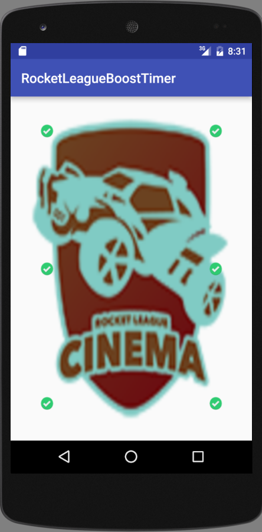

# Welcome to the Source page for Rocket League Boost Timer

Information
------
Rocket League Boost Timer is an App that regulates the Major boosts on the (classical) maps in Rocket League. Once you pick a major boost up, click the corresponding boost on the App.
The green check mark means the boost is available, while the red x means that the boost has already been picked up. Once the boost pops back up, the timer will display a toast, letting you know that the boost
is available to pick up again -- also changing the boost image to a green check mark.

### Other Information
I know that this is a pretty primitive App however it was really fun to make and I learned a lot from doing it! Let me know what you think. 
